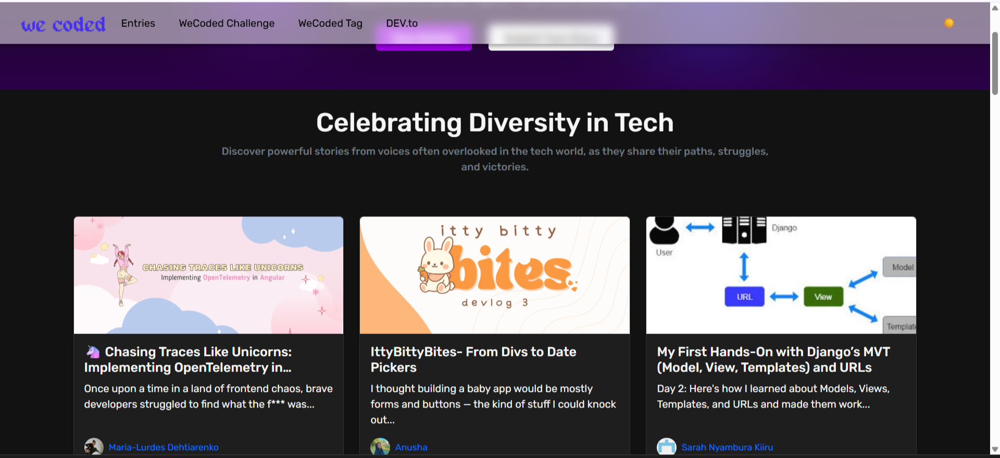

# WeCoded Landing Page 🌐

**Celebrate in Code** — a visually captivating, modern landing page crafted for the **WeCoded 2025 Challenge**, following the “Celebrate in Code” prompt. This project is designed to inspire, engage, and shine a light on diversity in tech.

## 🚀 Live Demo
[View the live site](https://wecoded-landing-page.vercel.app)  

## ✨ Table of Contents
1. [Key Features](#key-features)  
2. [Demo & Screenshots](#demo--screenshots)  
3. [Tech Stack](#tech-stack)  
4. [Getting Started](#getting-started)  
5. [Project Structure](#project-structure)  
6. [Coding Standards & Linting](#coding-standards--linting)  
7. [Contributing](#contributing)  
8. [License](#license)  

---

## Key Features
- Toggleable **Dark & Light Mode** for user preference 🌙 ☀️ ([dev.to](https://dev.to/kelvincode1234/my-wecoded-landing-page-3g5c?utm_source=chatgpt.com))  
- Smooth navigation across sections with responsive design  
- Professional footer with essential links and a cohesive layout  
- Clean, performance-first build prioritising accessibility ([dev.to](https://dev.to/vibha_parashar/my-wecoded-landing-page-4cd7?utm_source=chatgpt.com), [dev.to](https://dev.to/kelvincode1234/my-wecoded-landing-page-3g5c?utm_source=chatgpt.com))  

---

## Demo & Screenshots
Check out these highlights from the user journey and aesthetic transitions.



---

## Tech Stack
- **React** + **Vite** – lightning-fast dev builds & hot module replacement  
- **TypeScript** – strong types for scalable, maintainable code  
- **CSS** – custom styles tailored for the WeCoded branding  
- **ESLint** – coding standards and consistency  
- **Vercel** – seamless deployment and hosting  

---

## Getting Started

### Prerequisites
Ensure you have:
- [Node.js](https://nodejs.org/) v14+  
- npm or yarn

### Installation
1. Clone the repo  
   ```bash
   git clone https://github.com/KelvinCode1234/wecoded-landing-page.git
   cd wecoded-landing-page
   ```
2. Install dependencies  
   ```bash
   npm install
   # or
   yarn install
   ```
3. Run the dev server  
   ```bash
   npm run dev
   # or
   yarn dev
   ```
4. Open `http://localhost:5173` (or the console URL) in your browser to view changes live.

---

## Project Structure

```
wecoded-landing-page/
├── public/               # Static files (icons, images)
├── src/
│   ├── assets/           # Images & media
│   ├── components/       # Reusable UI pieces
│   ├── styles/           # CSS stylesheets
│   └── main.tsx          # App entrypoint
├── index.html            # Main HTML container
├── package.json          # Scripts & dependencies
├── vite.config.ts        # Vite configuration
└── eslint.config.js      # ESLint ruleset
```

---

## Coding Standards & Linting
This project follows ESLint best practices:
- Type-aware rules via `typescript-eslint`
- React-specific linting (`eslint-plugin-react`)
- Consistent formatting and error-spotting

To run checks:
```bash
npm run lint
npm run lint:fix
```

---

## Contributing
Your contributions are welcome! 🎉

- Fork it  
- Create your feature branch (`git checkout -b feature/AmazingFeature`)  
- Commit your changes (`git commit -m 'Add AmazingFeature'`)  
- Push branch (`git push origin feature/AmazingFeature`)  
- Open a Pull Request and share your vision  

---

## License
This project is licensed under the **MIT License** — feel free to fork, remix, and build on top.  

---

## Author
**Precious Kelvin Nwaogu (KelvinCode1234)**  
Frontend dev blending design with hand‑crafted code, always celebrating diversity in tech.
